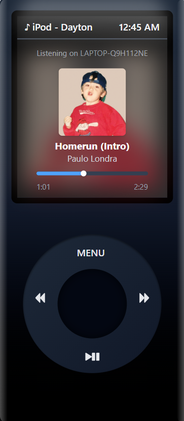

# Spotify iPod Electron App

A nostalgic iPod-inspired music player that connects to your Spotify account. Control your Spotify playback with a classic iPod interface, built with Electron, React, and the Spotify Web API.



## Features

- Classic iPod interface with click wheel navigation
- Spotify authentication directly in the Electron app
- Browse and play your Spotify playlists
- View and control currently playing track
- Seek through tracks using the progress bar
- Modern, responsive design with a nostalgic feel

## Technology Stack

- **Electron**: Cross-platform desktop application framework
- **React**: JS library for building the interface
- **Tailwind CSS**: Utility-first CSS framework for styling
- **Spotify Web API**: For authentication and music playback

## Prerequisites

- Node.js (v16 or higher)
- npm or yarn
- Spotify Developer Account and registered application
- Spotify Premium Account

## Setup

1. **Clone the repository**

```bash
git clone https://github.com/daytuns/ipod.git
cd iPod
```

2. **Install dependencies**

```bash
# Install root dependencies
npm install

# Install client dependencies
cd client
npm install
cd ..
```

3. **Create a Spotify Developer Application**

- Go to [Spotify Developer Dashboard](https://developer.spotify.com/dashboard/)
- Create a new application
- Set the redirect URI to `spotify-ipod-electron://callback`
- Note your Client ID and Client Secret

4. **Configure environment variables**

- Create a `.env` file in the root directory based on `.env.example`
- Add your Spotify Client ID and Client Secret

5. **Start the application**

```bash
npm run dev
```

## Development

- `npm run dev` - Starts both the Electron app and React development server
- `npm run dev-client` - Starts only the React development server
- `npm run dev-electron` - Starts only the Electron app (requires React server to be running)

## Project Structure

```
iPod/
├── client/                  # React frontend
│   ├── src/
│   │   ├── components/      # React components
│   │   ├── hooks/           # Custom React hooks
│   │   └── assets/          # Static assets
├── main.js                  # Electron main process
├── preload.js               # Electron preload script
└── package.json             # Project dependencies and scripts
```

## How It Works

1. The app authenticates with Spotify using OAuth 2.0 flow
2. Authentication is handled directly in the Electron main process
3. The main process communicates with the renderer process via IPC
4. The React app provides the iPod interface and controls
5. Spotify playback is controlled via the Spotify Web API

## Contributing

Contributions are welcome! Please feel free to submit a Pull Request.

## Acknowledgements

- Inspired by the classic iPod design
- Thanks to Spotify for their excellent Web API
- Built with Electron and React
